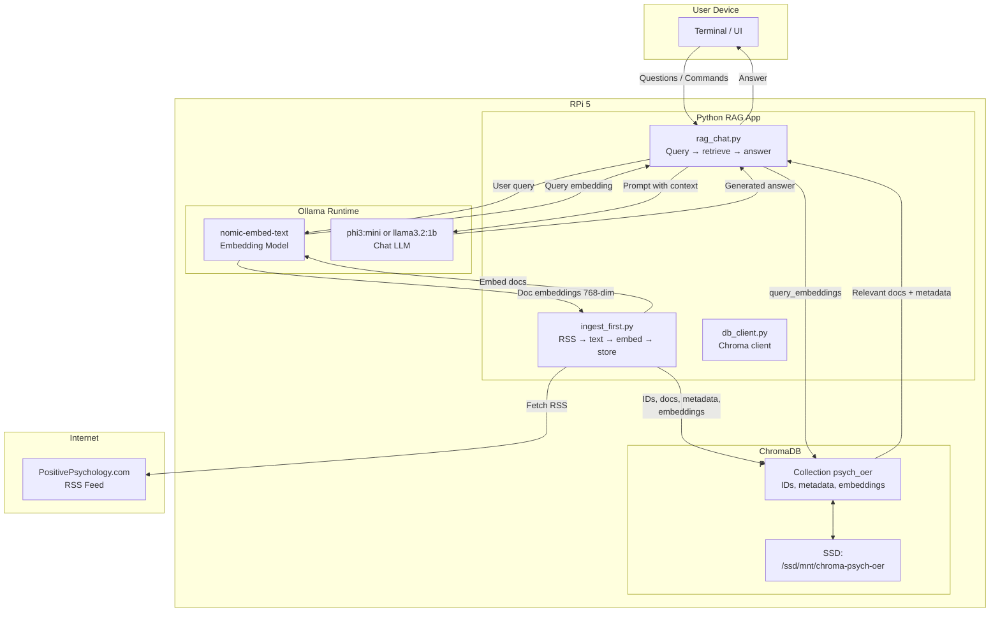

# Local LLM + RAG on Raspberry Pi 5

This README walks through a complete, repeatable setup of a **local RAG chatbot** on a **Raspberry Pi 5 (8GB)** using:
- **Ollama** for local LLM + embeddings
- **ChromaDB** for vector storage (persistent on external SSD)
- **Python** pipeline ingesting **PositivePsychology.com** RSS (Open Educational Resources for wellbeing)

It also covers **common permission pitfalls** and **clean-up / re-create** steps so you can iterate safely.

> Assumptions:
> - Raspberry Pi 5, 64‑bit OS, external SSD mounted at `/ssd/mnt`  
> - Project directory: `/opt/projects/local-llm-with-rag`  
> - You run commands as your **normal user** (e.g., `usr`), only using `sudo` where specified.

---

## Architecture Diagram:



## 1. System Prep (Pi 5 + SSD)

### 1.1 Update OS and basic tools

```bash
sudo apt update && sudo apt upgrade -y
sudo apt install -y python3 python3-venv python3-pip git curl
```

### 1.2 Ensure SSD mount

Mount your external SSD at `/ssd/mnt` (adjust to your setup if different), and then:

```bash
sudo mkdir -p /ssd/mnt
# (mount it via /etc/fstab or manually; verify with:)
df -h | grep /ssd/mnt
```

We will store all vector DB data under `/ssd/mnt` so we don't burn the SD card.

---

## 2. Install Ollama on Raspberry Pi 5

Ollama provides an official ARM64 installer that sets up the binary and `ollama.service` automatically.[web:157][web:159][web:219]

### 2.1 Install Ollama

```bash
curl -fsSL https://ollama.com/install.sh | sh
```

This installs Ollama and registers a systemd service.[web:157][web:159][web:228]

### 2.2 Start and enable the service

```bash
sudo systemctl enable ollama
sudo systemctl start ollama
sudo systemctl status ollama --no-pager
```

You should see `Active: active (running)` and a note that the API is at `127.0.0.1:11434`.[web:228]

### 2.3 Sanity check

```bash
curl http://localhost:11434/api/tags
```

Expected: `{"models":[]}` (no models yet).

---

## 3. Create Project + Virtualenv (Permissions Correctly)

We’ll put the project under `/opt/projects`, but you **must own** this directory to avoid permission errors later.

### 3.1 Create and fix ownership

```bash
sudo mkdir -p /opt/projects
sudo chown -R "$USER":"$USER" /opt/projects
```

### 3.2 Create project structure

```bash
cd /opt/projects
mkdir -p local-llm-with-rag
cd local-llm-with-rag
```

### 3.3 Create a clean venv (avoid root / permission issues)

**Important:** Never create a venv as root under a user-owned project, and never use `sudo pip` inside the venv. If you get permission errors like:

> `[Errno 13] Permission denied: '/opt/projects/local-llm-with-rag/.venv/...`

fix by:

```bash
# From project root
deactivate 2>/dev/null || true
rm -rf .venv                  # destroy broken venv
sudo chown -R "$USER":"$USER" /opt/projects/local-llm-with-rag

python3 -m venv .venv         # recreate as your user
source .venv/bin/activate

pip install --upgrade pip
```

Now install dependencies:

```bash
pip install chromadb feedparser ollama requests beautifulsoup4 trafilatura pdfplumber pyyaml
```

---

## 4. Models on Pi (Embeddings + Chat LLM)

### 4.1 Pull embedding model

We’ll use `nomic-embed-text` via Ollama for **768‑dim embeddings**.[web:30][web:43]

```bash
ollama pull nomic-embed-text
```

Check:

```bash
ollama list
curl http://localhost:11434/api/embeddings -d '{
  "model": "nomic-embed-text",
  "prompt": "test embedding"
}'
```

### 4.2 Pull a small chat model (phi or llama)

On Pi 5, good options include `phi3:mini` or `llama3.2:1b` for speed.[web:85][web:89]

Example:

```bash
ollama pull phi3:mini
# or: ollama pull llama3.2:1b
```

Verify:

```bash
ollama list
```

---

## 5. ChromaDB Persistent Client (on SSD)

We’ll use a **persistent** Chroma client, storing everything under `/ssd/mnt/chroma-psych-oer`.[web:203][web:208][web:212][web:226]

### 5.1 Ensure SSD directory exists and is writable

```bash
sudo mkdir -p /ssd/mnt/chroma-psych-oer
sudo chown -R "$USER":"$USER" /ssd/mnt/chroma-psych-oer
```

### 5.2 `db_client.py`

Create `/opt/projects/local-llm-with-rag/db_client.py`:

```python
import chromadb
from chromadb.config import Settings

CHROMA_PATH = "/ssd/mnt/chroma-psych-oer"

client = chromadb.PersistentClient(
    path=CHROMA_PATH,
    settings=Settings(is_persistent=True)
)

COLLECTION_NAME = "psych_oer"

# We will manage embeddings ourselves (Ollama), so no embedding_function here.
collection = client.get_or_create_collection(
    name=COLLECTION_NAME,
    metadata={"hnsw:space": "cosine"}
)

def get_collection():
    return collection

def get_client():
    return client
```

If you see `Permission denied (os error 13)` from Chroma, re-check:

```bash
sudo chown -R "$USER":"$USER" /ssd/mnt/chroma-psych-oer
```

and ensure you’re *not* running your Python under `sudo`.[web:209][web:210]

---

## 6. Ingestion: Psychology OER via RSS

We’ll start with PositivePsychology.com’s blog RSS feed (high-quality wellbeing content).[web:22]

### 6.1 `ingest_first.py`

Create `/opt/projects/local-llm-with-rag/ingest_first.py`:

```python
import feedparser
import ollama
import hashlib, re
from datetime import datetime
from time import mktime
from db_client import get_collection

RSS_URL = "https://positivepsychology.com/feed/"

collection = get_collection()

def clean_text(text):
    text = re.sub(r'<[^>]+>', '', text or "")
    return re.sub(r'\s+', ' ', text).strip()

feed = feedparser.parse(RSS_URL)

ids = []
documents = []
metadatas = []
embeddings = []

for entry in feed.entries[:5]:
    title = entry.title
    url = entry.link

    pub_struct = entry.get('published_parsed')
    if pub_struct:
        published = datetime.fromtimestamp(mktime(pub_struct))
    else:
        published = datetime.now()

    summary = clean_text(getattr(entry, "summary", ""))
    full_text = f"{title}. {summary}"[:4000]

    # deterministic ID
    doc_hash = hashlib.md5(f"{url}{published}".encode()).hexdigest()
    doc_id = f"pp_{doc_hash}"

    # 768-dim embedding from Ollama (CPU-heavy, but done once per doc)
    emb = ollama.embeddings(model="nomic-embed-text", prompt=full_text)["embedding"]

    ids.append(doc_id)
    documents.append(full_text)
    metadatas.append({
        "title": title,
        "url": url,
        "published": published.isoformat(),
        "source": "positivepsychology",
        "tags": "wellbeing,positive_psychology",  # string, not list (Chroma metadata requirement)
    })
    embeddings.append(emb)

    print(f"Queued: {title[:60]}...")

collection.add(
    ids=ids,
    documents=documents,
    metadatas=metadatas,
    embeddings=embeddings,
)

print(f"✅ Ingested {len(ids)} articles into Chroma with Ollama embeddings.")
```

### 6.2 Run ingestion

```bash
cd /opt/projects/local-llm-with-rag
source .venv/bin/activate
python ingest_first.py
```

Expected:

- 5 “Queued: …” lines
- `✅ Ingested 5 articles into Chroma with Ollama embeddings.`

**Warnings like** `device_discovery.cc: GPU device discovery failed` from ONNX Runtime are normal on Pi (no GPU), safe to ignore.[web:209][web:212]

---

## 7. RAG Chatbot (Pi 5 + Chroma + Ollama)

### 7.1 `rag_chat.py`

Create `/opt/projects/local-llm-with-rag/rag_chat.py`:

```python
import ollama
from db_client import get_collection

EMB_MODEL = "nomic-embed-text"
LLM_MODEL = "phi3:mini"  # or "llama3.2:1b"

collection = get_collection()

def retrieve_context(query, top_k=3):
    # Embed user query
    q_emb = ollama.embeddings(model=EMB_MODEL, prompt=query)["embedding"]

    # Query Chroma with 768-dim embedding
    results = collection.query(
        query_embeddings=[q_emb],
        n_results=top_k,
        include=["documents", "metadatas", "distances"],
    )

    ctx = "Relevant OER excerpts:\n\n"
    if not results["documents"]:
        return ctx + "None.\n"

    docs = results["documents"]
    metas = results["metadatas"]
    dists = results["distances"]

    for i, (doc, meta, dist) in enumerate(zip(docs, metas, dists), 1):
        ctx += f"[{i}] {meta.get('title','')} ({meta.get('published','')[:10]})\n"
        ctx += f"Score: {1 - dist:.3f}\n"
        ctx += f"{doc[:600]}...\n\n"
    return ctx

print("🧠 Pi5 + Chroma Psych OER RAG ('exit' to quit)")

while True:
    q = input("\nYou: ").strip()
    if q.lower() in ("exit", "quit"):
        break

    context = retrieve_context(q)
    prompt = f"""You are a psychology/wellbeing assistant using ONLY the OER context.

{context}

Question: {q}

Answer in a practical, evidence-informed, non-clinical way. Not medical advice.
"""

    resp = ollama.chat(
        model=LLM_MODEL,
        messages=[{"role": "user", "content": prompt}],
        options={
            "num_predict": 160,   # cap length for speed
            "num_thread": 4       # adjust to Pi CPU cores
        },
    )
    print("\n🤖:", resp["message"]["content"], "\n")
```

### 7.2 Run the chatbot

```bash
python rag_chat.py
```

Test:

```text
You: How to manage confidence?
```

Expect the Pi’s CPU to spike (fan may spin), and a response in ~10–30s depending on model, but now with:

- **Local embeddings**
- **Local vector search**
- **Local LLM generation**

---

## 8. Clean-Up and Re-Creation Procedures

### 8.1 Destroy and recreate Python venv (fixing permission issues)

If you ever see permission errors inside `.venv` (e.g., `[Errno 13] Permission denied: '.venv/lib/python3.13/site-packages/...'`):

```bash
cd /opt/projects/local-llm-with-rag
deactivate 2>/dev/null || true
rm -rf .venv

sudo chown -R "$USER":"$USER" /opt/projects/local-llm-with-rag

python3 -m venv .venv
source .venv/bin/activate
pip install --upgrade pip
pip install chromadb feedparser ollama requests beautifulsoup4 trafilatura pdfplumber pyyaml
```

### 8.2 Destroy and recreate Chroma collection

If you want a clean DB:

```python
# delete_collection.py
from db_client import get_client, COLLECTION_NAME

client = get_client()
client.delete_collection(COLLECTION_NAME)
print("Deleted collection", COLLECTION_NAME)
```

Run:

```bash
python delete_collection.py
python ingest_first.py  # recreate and re-ingest
```

This avoids stale dimension mismatches (e.g., going from Chroma’s built-in 384‑dim to Ollama’s 768‑dim embeddings).[web:203][web:209]

### 8.3 Completely reset Chroma storage

To wipe all Chroma data:

```bash
sudo rm -rf /ssd/mnt/chroma-psych-oer
sudo mkdir -p /ssd/mnt/chroma-psych-oer
sudo chown -R "$USER":"$USER" /ssd/mnt/chroma-psych-oer
python ingest_first.py
```

### 8.4 Remove Ollama models or reinstall

To list/remove models:

```bash
ollama list
ollama rm phi3:mini
ollama rm nomic-embed-text
```

To fully reinstall Ollama (rarely needed):

```bash
# Check docs first; generally uninstall via package manager or remove binary + service,
# then re-run:
curl -fsSL https://ollama.com/install.sh | sh
```

---

## 9. Notes on Performance Expectations

- **Pi 5 + CPU‑only** inference will be CPU- and memory-bandwidth bound; 1B–3B models will answer, but not instantly.
- Embedding + retrieval (Chroma) is fast; slow part is:
  - `ollama.embeddings` calls
  - `ollama.chat` generation

You can:

- Use **smaller models** (`llama3.2:1b`, `phi3:mini`) to speed up responses.
- Tighten `num_predict` and context length to trade off verbosity for latency.

For “production UX,” you’d typically keep this stack and swap the LLM to a GPU node or API, but as an **offline experiment**, this README gives you a reproducible way to create, destroy, clean up, and rebuild the full RAG pipeline on a Raspberry Pi 5.
